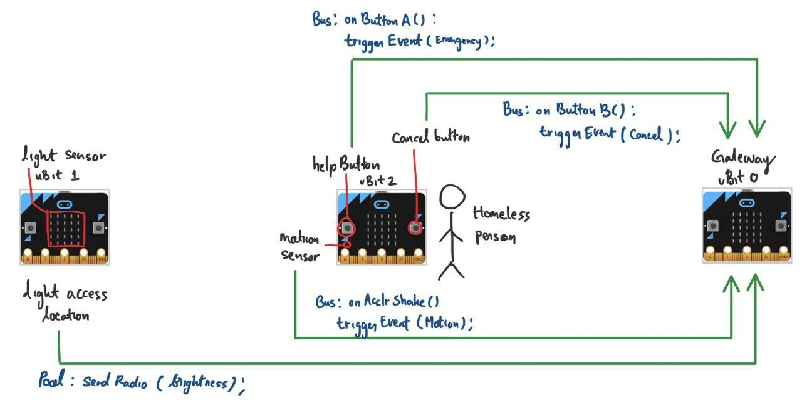

# SMU CS106 Embedded Systems Lab 2

**Members**: 

* Bryan Lee

* Charlie Angriawan

* Emmanuel Oh

* Zhi An Yuen

  

## Challenge 1. You don’t know our pain

A charity caring for homeless persons in Singapore is keen to adopt technology for their work. You
decide to help this charity deploy a monitoring system at a deserted place where a homeless person
sleeps. The system comprises several sensors that send data to a gateway. In a real system (but not
required for this challenge), the gateway sends data to the cloud, where it can be further processed.



### Setup

#### Flashing micro:bits

1. Install [`yotta`](http://docs.yottabuild.org/#installing) and `srecord` [[windows]](http://srecord.sourceforge.net/) [[ubuntu]](https://packages.ubuntu.com/bionic/srecord)
2. Connect all of your micro:bits to your machine

3. Flash all the micro:bit manually or using the script (Ubuntu example)

```bash
$ ./flash.sh challenge1 lightsensor /media/charlie/MICROBIT1
$ ./flash.sh challenge1 wearable /media/charlie/MICROBIT2
$ ./flash.sh challenge1 gateway /media/charlie/MICROBIT3
```


## Challenge 2. I don’t stop when I’m tired, I stop when I’m done

You can use up to 8 micro:bits for this challenge. Suppose the micro:bits are spaced equally along the
circumference of a circle. Develop an application that causes exactly 1 micro:bit to be lit when one
person inside the circle walks continuously, and causes all micro:bits to be unlit, when the person
stops walking.


### Goal

Successfully implements motion detection using micro:bits that are spaced equally along the circumference of a circle.

### Our approach

In our implementation, we require one and only one micro:bit to take up the role of the `leader` which will be actively listening to radio signals in a designated channel while the rest of the micro:bits will take up the role of `member` and constantly broadcasts important data points such as signal disruptions readings to the channel. 

**Variables relevant in our implementation:**

`ssi` - radio signal strength - the received signal strength indicator (RSSI)

`flux` - radio signal fluctuation - the rate of change of the signal strength on a given interval

**Logical process flow:**

1. Each `member` will start processing radio signals at a fixed interval
2. `member` micro:bits will constantly broadcast a signal to a designated channel.
3. For every message received at an interval, each `member` will compute and keep track of `ssi` of any package received and calculate `flux` from its `ssi` rate of change.
4. If the `flux` cross a certain threshold, `member` will then report that it senses a signal disruption to the `leader`.
6.  When `leader` receives a signal disruption broadcast, it will light up its 2<sup>nd</sup> to 4<sup>th</sup> rows of LEDs.


### Setup

#### Flashing micro:bits

1. Install [`yotta`](http://docs.yottabuild.org/#installing) and `srecord` [[windows]](http://srecord.sourceforge.net/) [[ubuntu]](https://packages.ubuntu.com/bionic/srecord)

2. Connect all of your micro:bits to your machine

3. Flash all the micro:bit manually or using the script (Ubuntu example)

   Script syntax: `./flash.sh challenge{num} {module} {microbit_path}`
```bash
$ ./flash.sh challenge2 motionsensor /media/charlie/MICROBIT1
$ ./flash.sh challenge2 motionsensor /media/charlie/MICROBIT2
$ ./flash.sh challenge2 motionsensor /media/charlie/MICROBIT3
...
```

4. Set the micro:bits equally spaced along the circumference of a circle using the following setup


#### Setting up micro:bits

<table>
    <tr>
        <th>Illustration</th>
    	<th>Description</th>
    </tr>
    <tr>
    	<td rowspan=3>
            
        </td>
        <td>
            <b>LED Panel A:</b> Indicate role in the network
            <br>
            Leadership can be self assigned by holding button AB
            <br>
            (ON: leader, OFF: member)
        </td>
  	</tr>
    <tr>
    	<td>
            <b>LED Panel B:</b> Indicate motion detection (Only for leader)
            <br>
            (ON: motion detected, OFF: no motion detected)
        </td>
  	</tr>
    <tr>
    	<td>
            <b>LED Panel C:</b> Indicate which channel the microbit is in
            <br>
            Channel can be changed by pressing Button A or Button B
            <br>
            (OFF: no channel joined, LED_N: channel_n)
        </td>
  	</tr>
    <tr>
    	<td>
            
        </td>
        <td>
            <b>Example:</b> Leader micro:bit detecting movement in channel 1
        </td>
  	</tr>
</table>


#### Laying out micro:bits (Tested up to 8 micro:bits)

As per the requirement, micro:bits are to be spaced equally along the circumference of a circle. After flashing up the micro:bits, you will then need to set up each micro:bits to its role and channel.

1. On **micro:bit 1**, hold `button_a` and `button_b` together to assign itself to a leader
2. On **micro:bit 1** and **micro:bit 2 (opposite to micro:bit 1)**  , press `button_a` 1 time to set the micro:bit to listen to channel 1
3. On **micro:bit 3** and **micro:bit 4 (opposite to micro:bit 3)**, press `button_a` 2 time to set the micro:bit to listen to channel 2
4. On **micro:bit 5** and **micro:bit 6 (opposite to micro:bit 5)**, press `button_a` 3 time to set the micro:bit to listen to channel 3
5. On **micro:bit 7** and **micro:bit 8 (opposite to micro:bit 7)**, press `button_a` 4 time to set the micro:bit to listen to channel 4


Each micro:bits is now sending signal across each other and any motion inside the circle would disrupt the radio signal and cause fluctuation. When this happen, micro:bit will switch its channel to `reporting channel` and send a packet buffer indicating that its signal has been interrupted.

The `leader` micro:bit primary role in the network is to listen to this `report` and light up when there is any radio interruption sent by any of its members.


### Testing

Walk around in circle or do any motion inside the micro:bit consortium. Refer to the video folder. 


### Obstructions faced

1. **Radio channel**

   We experienced a different behavior of the system in two different test locations.

   First testing of motion detecting was done in one of our home. Radio disruption signals were being read properly by the `leader microbit`. However, the system behaves differently and were buggy during our second test near the computing lab.

   What we found out:

   - The disruption was caused by an interruption in radio channel 1. Random packages are constantly being broadcast near the testing location causing our system to misbehave.
   - The micro:bits can send/receive radio signals as far as 70 meters

   Solution:

   - Add a message identifier on the first byte of packet buffer so that we can ignore incoming interruptions in the same channel.

2. **Frequency band set too high**

   Signal fluctuates more unstably on a higher frequency band.

3. **Noisy data when working with too many connection (Initial approach)**

   Our initial approach was to have all micro:bits broadcast signal to a designated channel and have the members count the total number of micro:bits inside the network. Combined with the mistake of setting frequency band too high, the signal fluctuates unstably especially when more micro:bits are connected to the network.

4. **Integer division causes loss of precision (Initial approach)**

   Since we need to average out the total broadcast signal to get the flux, we divide the total radio strength with number of micro:bits in the network. However, we lost the decimal precision which we wanted. Since Packet Buffer can only send data in array bytes, we multiply the total strength by 10 before doing the division to preserve at least the first mantissa.

5. **Packet Loss (Initial approach)**

   When walking between two micro:bits, there is a possibility that the signal is completely lost such as when it is completely blocked by your body which causes issue in our calculation. This was then solved by having all the members counting the number of micro:bits it perceive to detect and then taking the maximum out of all the micro:bits.
